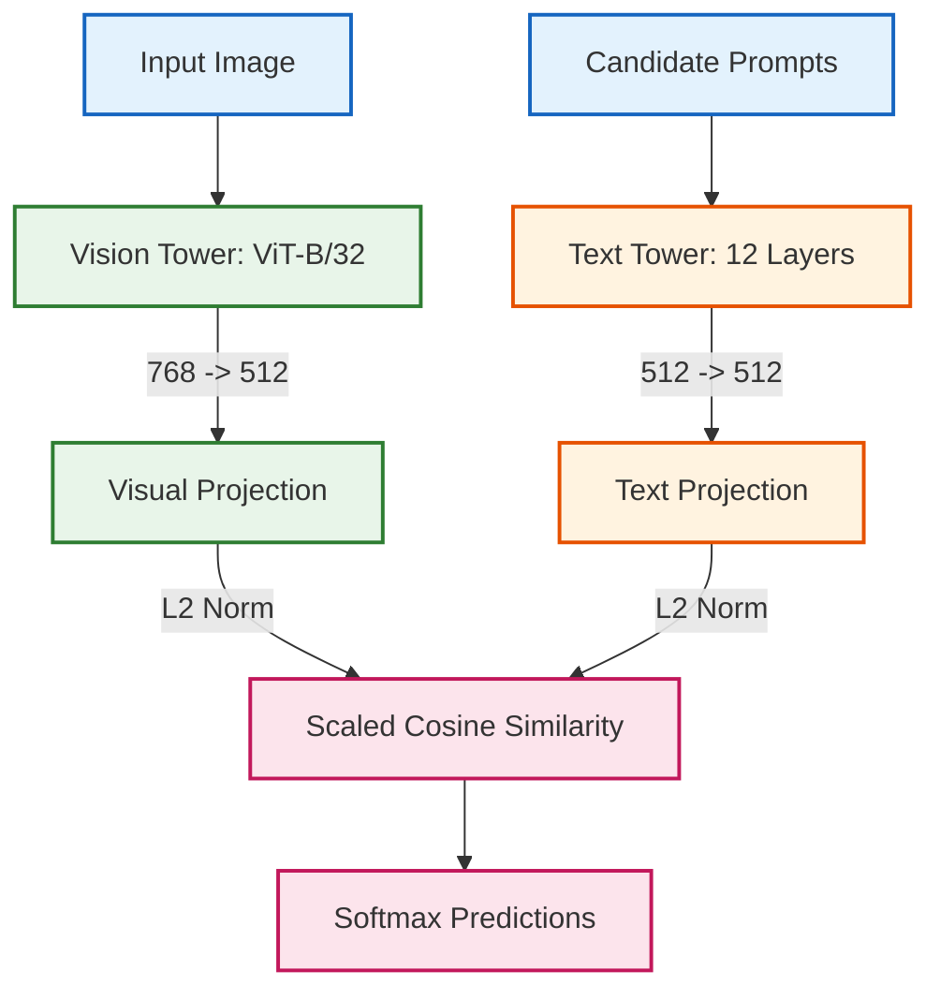

# CLIP — PyTorch Implementation

A modular, dependency-light PyTorch clean-room implementation of OpenAI's **CLIP** (Contrastive Language-Image Pre-Training) (`openai/clip-vit-base-patch32`).

---

## 🧠 Architectural Overview

CLIP trains a vision transformer and a text transformer concurrently to predict the correct pairings of an image and text snippet within a shared embedding space.



- **Detailed Tensor Flow**: See [`assets/detailed_diagram.mmd`](./assets/detailed_diagram.mmd)
- **High-Level Flow**: See [`assets/high_overview_diagram.mmd`](./assets/high_overview_diagram.mmd)

---

## ⚙️ Technical Highlights

1. **Dual Metric Embedding Alignment**:
   $$\text{logits} = \exp(\tau) \cdot \left(\frac{\mathbf{v}}{\|\mathbf{v}\|_2}\right) \left(\frac{\mathbf{t}}{\|\mathbf{t}\|_2}\right)^T$$
2. **FlashAttention Acceleration**: Native `F.scaled_dot_product_attention` handles self-attention and causal masking across both towers.
3. **Weight Compatibility**: State dictionaries match official Hugging Face checkpoints (`openai/clip-vit-base-patch32`) without weight conversion scripts.
4. **Shared Codebase Reuse**: Fully leverages `Zoo.Common.model_loader` for streaming shard downloads, automatic device detection (`auto_detect_device_and_dtype`), and global strict verification.

---

## 🚀 Quickstart

```bash
python Zoo/serve_zero_shot.py
```
