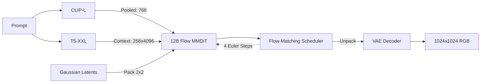

# FLUX.1 [schnell] — PyTorch Implementation

A modular, dependency-light PyTorch clean-room implementation of **FLUX.1 [schnell]** by Black Forest Labs. It features a 12-billion parameter Rectified Flow Transformer (MMDiT), 16-channel AutoencoderKL, dynamic exponential time shifting, and dual CLIP-L / T5-XXL prompt conditioning.

---

## 🧠 System Architecture

FLUX.1 operates on a packed $2 \times 2$ latent token manifold with 16 continuous VAE channels ($64$ channels per patch token):



- **Detailed Tensor Flow**: See [`assets/detailed_diagram.mmd`](./assets/detailed_diagram.mmd)
- **High-Level Flow Diagram**: See [`assets/high_overview_diagram.mmd`](./assets/high_overview_diagram.mmd)

---

## ⚡ Key Architectural Features

1. **Dual-Stream & Single-Stream MMDiT (`modules/FluxTransformer2DModel.py`)**:
   - 19 Dual-Stream blocks allowing image and text features to cross-attend while preserving separate layer normalizations.
   - 38 Single-Stream blocks concatenating image and text representations into a joint sequence processed by parallel self-attention and MLP blocks.
2. **3D Multi-Axis RoPE (`FluxPosEmbed`)**:
   - Assigns 3D rotational coordinates `(T, H, W)` with head dimension split `(16, 56, 56)`.
3. **Sequence-Dependent Dynamic Time Shifting (`modules/SchedulingFlowMatchEulerDiscrete.py`)**:
   - Calculates time shift coefficient $\mu = f(\text{seq\_len})$ and applies exponential shifts to prioritize high-noise vector fields.
4. **16-Channel VAE with Latent Rescaling (`modules/AutoEncoderKL.py`)**:
   - Normalization: $z_{\text{norm}} = (z - 0.1159) \cdot 0.3611$.

---

## 🚀 Quickstart

### Launch Multi-Model Web Studio

Run the unified interface to switch between Stable Diffusion and FLUX:

```bash
python Zoo/generate_image.py
```

### Programmatic Python Usage

```python
from Zoo.FLUX1Schnell.FLUX import FluxModel

# 1. Initialize Pipeline
pipeline = FluxModel.from_pretrained_weights()

# 2. Synthesize High-Resolution 1024x1024 Image (4 steps)
image = pipeline(
    prompt="A futuristic DeLorean cruising on a luminous neon highway in space, 8k",
    height=1024,
    width=1024,
    num_inference_steps=4,
    seed=42,
)
image.save("flux_output.png")
```
