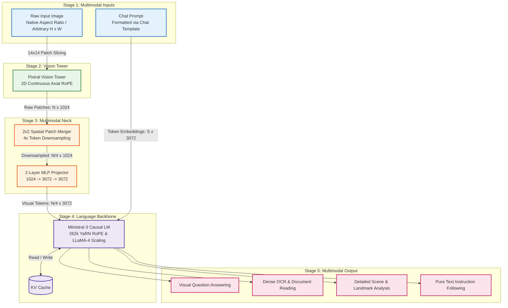

# Ministral-3 Multimodal — PyTorch Implementation

A modular, clean-room PyTorch implementation of Mistral AI's **Ministral-3 Multimodal** (`mistralai/Ministral-3-3B-Instruct-2512-BF16`). It couples the **Pixtral** vision encoder with the **Ministral-3** language model backbone via a **$2 \times 2$ spatial patch-merging projector**.

---

## 🧠 System Architecture

Ministral-3 processes images at their **native aspect ratios** without square resizing, applies 2D continuous positional rotations, downsamples tokens by $75\%$ to conserve context, and processes up to **262k tokens** via YaRN RoPE:



- **Detailed Tensor Specification**: See [`assets/detailed_diagram.mmd`](./assets/detailed_diagram.mmd)
- **High-Level Flow Diagram**: See [`assets/high_overview_diagram.mmd`](./assets/high_overview_diagram.mmd)

---

## ⚡ Architectural Deep Dive

### 1. Pixtral Dynamic-Resolution Vision Tower (`modules/PixtralVision.py`)
- **Native Resolution**: Images are partitioned into variable grids without aspect ratio distortion:
  $$h_p = \lfloor H / 14 \rfloor, \quad w_p = \lfloor W / 14 \rfloor$$
- **2D Continuous Axial RoPE**: Rotary frequencies are calculated separately for $y$ and $x$ coordinates and interleaved into an $[H, W, H, W]$ layout, preserving 2D spatial relationships regardless of resolution.
- **Block-Diagonal Attention**: Multi-image batches are packed into a single sequence and isolated via boolean block-diagonal masks, preventing cross-image attention leakage without padding compute.

### 2. Spatial 2×2 Patch Merger & Projector (`modules/Mistral3MultiModalProjector.py`)
- **4× Spatial Downsampling**: Groups adjacent $2 \times 2$ patch neighborhoods via `torch.nn.functional.unfold(kernel_size=2, stride=2)`:
  $$(N, 1024) \xrightarrow{\text{Unfold}} (N/4, 4096) \xrightarrow{\text{Linear}} (N/4, 1024)$$
- **Sequence Compression**: Compresses token count by **$75\%$**, enabling processing of ultra-high-resolution images without exhausting LLM context limits.
- **2-Layer MLP Projector**: Projects features through $1024 \to 3072 \to \text{GELU} \to 3072$.

### 3. Ministral-3 Language Backbone (`modules/Ministral3.py`)
- **Standard Pre-LN Blocks**: 26 layers using standard Pre-Norm residual connections:
  $$x = x + \text{Attn}(\text{RMSNorm}(x)), \quad x = x + \text{MLP}(\text{RMSNorm}(x))$$
- **YaRN RoPE (262k Tokens)**: Merges interpolation and extrapolation across frequency bands:
  - High Frequencies: Unmodified (extrapolation).
  - Low Frequencies: Scaled by context factor $S=16$ (interpolation).
  - Mid Frequencies: Smooth ramp interpolation between $\beta_{\text{fast}}=32$ and $\beta_{\text{slow}}=1$.
- **LLaMA-4 Query Log-Scaling**: Dampens query magnitudes at large sequence depths to prevent attention entropy collapse:
  $$\mathbf{Q}' = \mathbf{Q} \cdot \left(1.0 + 0.1 \cdot \ln\left(1.0 + \left\lfloor \frac{\text{pos}}{16384} \right\rfloor\right)\right)$$
- **Prefill Tail Slicing**: Evaluates `logits_to_keep=1` during the prefill phase, computing output vocabulary projections ($3072 \to 131072$) exclusively for the final token position.

---

## ⚖️ PaliGemma 2 vs. Ministral-3 Comparison

| Capability | PaliGemma 2 | Ministral-3 Multimodal |
| :--- | :--- | :--- |
| **Image Resolution** | Fixed $224 \times 224$ (Resized/Padded) | **Native Dynamic Aspect Ratio** (Up to $1540\text{px}$) |
| **Spatial Compression**| None ($1$ patch = $1$ LLM token) | **$2 \times 2$ Spatial Patch Merger** ($4\times$ token compression) |
| **Vision Position** | Learned 1D/2D table + Bicubic Interp | **2D Continuous Axial RoPE** ($[H, W, H, W]$) |
| **Context Length** | 4,096 tokens | **262,144 tokens (YaRN)** |
| **Instance Segmentation**| **Supported** (UViM VQ-VAE Decoder) | **Not Supported** (Language-focused) |
| **Pure Text Queries** | Poor (Requires image prefix) | **Supported** (Full general LLM capability) |

---

## 🚀 Quickstart

### Launch the Unified Studio
```bash
python Zoo/serve_multimodal.py
```