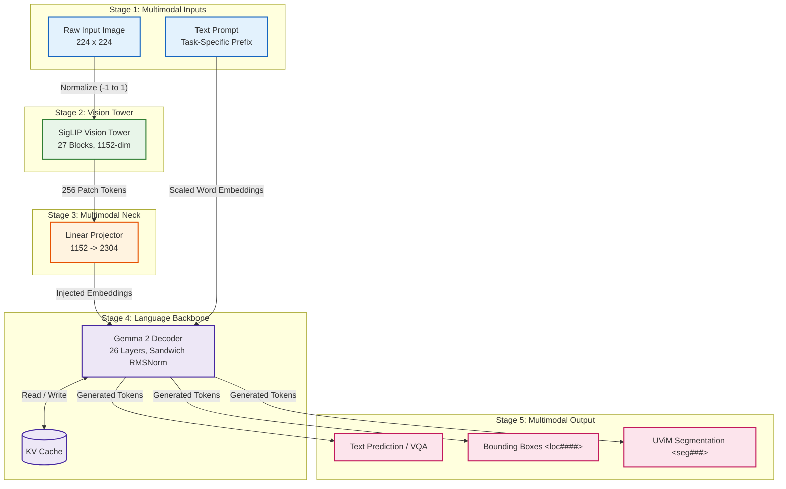

# PaliGemma 2 — PyTorch Implementation

A dependency-light, clean-room PyTorch implementation of Google's **PaliGemma 2** Vision-Language Model (`google/paligemma2-3b-mix-224`). It unifies a **SigLIP** vision encoder with an autoregressive **Gemma 2** backbone and includes the **UViM VQ-VAE Mask Decoder** for pixel-precise instance segmentation.

---

## 🧠 System Architecture

PaliGemma 2 integrates vision into language via **Prefix Embedding Injection**: images are tokenized into continuous feature vectors, projected into the hidden space of the language model, and scattered directly into placeholder slots within the input embedding sequence.



- **Detailed Tensor Specification**: See [`assets/detailed_diagram.mmd`](./assets/detailed_diagram.mmd)
- **High-Level Flow Diagram**: See [`assets/high_overview_diagram.mmd`](./assets/high_overview_diagram.mmd)

---

## ⚡ Architectural Deep Dive

### 1. SigLIP Vision Tower (`modules/SigLip.py`)

- **Patch Extraction**: A non-overlapping `Conv2d(stride=14, kernel_size=14)` transforms a $(224 \times 224 \times 3)$ image into $16 \times 16 = 256$ spatial patches of dimension $1152$.
- **Dynamic 2D Positional Interpolation**: For non-standard resolutions, `interpolate_2d_pos_embed` applies bicubic resampling to the 2D grid position embedding table before sequence flattening.
- **Transformer Encoder**: 27 Pre-LN Transformer blocks with 16 attention heads utilizing native PyTorch `F.scaled_dot_product_attention` (SDPA).

### 2. Linear Multimodal Projector (`PaliGemma2.py`)

- **Direct Dimension Alignment**: A single linear layer maps visual features from vision space ($1152$) to language model space ($2304$).
- **Scatter Injection**: Visual tokens replace placeholder tokens (`image_token_id = 257152`) within the word embedding sequence via `inputs_embeds.masked_scatter_`.

### 3. Gemma 2 Language Model (`modules/Gemma2.py`)

- **Offset RMSNorm**: Normalization incorporates unit offset scaling: $y = \text{RMSNorm}(x) \cdot (1.0 + \mathbf{w})$.
- **Sandwich Normalization**: Each of the 26 decoder blocks applies **4 LayerNorm operations** (pre- and post-attention, and pre- and post-MLP) to stabilize deep residual propagation.
- **Dual Logit Softcapping**: Prevents logit divergence in 16-bit precision:
  - Inside Attention: $\mathbf{S} = 50.0 \cdot \tanh(\mathbf{Q}\mathbf{K}^T / (16.0 \cdot 50.0))$
  - Final LM Head: $\text{logits} = 30.0 \cdot \tanh(\mathbf{W}_{\text{head}} \mathbf{h} / 30.0)$
- **Scaled Word Embeddings**: Lookups are scaled by $\sqrt{d_{\text{model}}} = \sqrt{2304} = 48.0$.
- **Weight Tying**: Output head weights are strictly tied to `embed_tokens.weight`.

### 4. UViM VQ-VAE Mask Decoder (`modules/MaskDecoder.py`)

- **Discrete Codebook**: Reads 16 predicted `<seg###>` tokens ($[0, 127]$).
- **Decoder Architecture**: Maps $(16) \to (16 \times 512) \to (4 \times 4 \times 512) \to$ 2 ResBlocks $\to$ 4 Transposed Convolutions ($4 \times 4 \to 8 \times 8 \to 16 \times 16 \to 32 \times 32 \to 64 \times 64$) $\to$ 1-channel binary mask logit.

---

## 🎯 Task Prefixes & Coordinate Parsing

PaliGemma 2 uses specialized prompt prefixes for downstream tasks:

| Task                 | Prompt Format                       | Output Format                                                 |
| :------------------- | :---------------------------------- | :------------------------------------------------------------ |
| **Captioning**       | `caption en`                        | `A dog sitting on a living room sofa.`                        |
| **Visual QA**        | `answer en What color is the sofa?` | `brown`                                                       |
| **Object Detection** | `detect cat ; dog`                  | `<loc0234><loc0120><loc0890><loc0540> cat`                    |
| **Segmentation**     | `segment cat`                       | `<loc0234><loc0120><loc0890><loc0540><seg012>...<seg099> cat` |

- **Coordinates**: Four `<loc####>` tokens define normalized bounding boxes in $[0, 1024]$:
  $$y_{\text{pixel}} = \left\lfloor \frac{\text{loc\_id}}{1024.0} \times H \right\rfloor, \quad x_{\text{pixel}} = \left\lfloor \frac{\text{loc\_id}}{1024.0} \times W \right\rfloor$$

---

## ⚖️ PaliGemma 2 vs. Ministral-3 Comparison

| Capability                | PaliGemma 2                             | Ministral-3 Multimodal                                              |
| :------------------------ | :-------------------------------------- | :------------------------------------------------------------------ |
| **Image Resolution**      | Fixed $224 \times 224$ (Resized/Padded) | **Native Dynamic Aspect Ratio** (Up to $1540\text{px}$)             |
| **Spatial Compression**   | None ($1$ patch = $1$ LLM token)        | **$2 \times 2$ Spatial Patch Merger** ($4\times$ token compression) |
| **Vision Position**       | Learned 1D/2D table + Bicubic Interp    | **2D Continuous Axial RoPE** ($[H, W, H, W]$)                       |
| **Context Length**        | 4,096 tokens                            | **262,144 tokens (YaRN)**                                           |
| **Instance Segmentation** | **Supported** (UViM VQ-VAE Decoder)     | **Not Supported** (Language-focused)                                |
| **Pure Text Queries**     | Poor (Requires image prefix)            | **Supported** (Full general LLM capability)                         |

---

## 🚀 Quickstart

### Launch the Unified Studio

```bash
python Zoo/serve_multimodal.py
```
