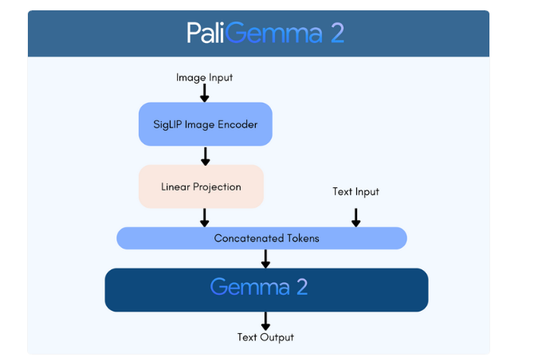

# PaliGemma 2 - PyTorch Implementation

A modular, high-performance PyTorch implementation of Google's **PaliGemma 2** Vision-Language Model. This model pairs a **SigLIP** vision encoder with an autoregressive **Gemma 2** language model to support captioning, Visual Question Answering (VQA), object detection (localization), and segmentation.

---

## 🧠 Architecture Overview

PaliGemma 2 operates via **prefix embedding injection**: input images are transformed into continuous visual tokens, projected into the language model's embedding space, and fused directly with the tokenized prompt before being processed autoregressively by the Gemma 2 decoder.



- Diagram source: [`assets/high_overview_diagram.mmd`](./assets/high_overview_diagram.mmd)
- Detailed tensor specification: [`assets/detailed_diagram.mmd`](./assets/detailed_diagram.mmd)

---

## 🎯 Supported Tasks & Prompt Formats

PaliGemma 2 mixture (`mix`) checkpoints are instruction-tuned to respond to specialized task prefixes:

| Task                     | Prompt Prefix Example                 | Output Format Example                                                                     |
| :----------------------- | :------------------------------------ | :---------------------------------------------------------------------------------------- |
| **Captioning**           | `caption en`                          | `A golden retriever catching a frisbee in a sunny park.`                                  |
| **Detailed Description** | `describe en`                         | `In this outdoor scene, a dog jumps mid-air...`                                           |
| **Visual QA**            | `answer en What is the animal doing?` | `jumping`                                                                                 |
| **Object Detection**     | `detect dog ; frisbee`                | `<loc0234><loc0120><loc0890><loc0540> dog ; <loc0310><loc0450><loc0420><loc0580> frisbee` |
| **Segmentation**         | `segment dog`                         | `<loc0234><loc0120><loc0890><loc0540><seg012>...<seg099> dog`                             |

_When detection coordinates are generated, the postprocessor automatically parses the `<loc####>` tokens and draws labeled bounding boxes onto the image._

---

## 🚀 How to Run

### 1. Install Dependencies

```powershell
uv add torch torchvision torchaudio --index-url https://download.pytorch.org/whl/cu121
uv add gradio huggingface_hub transformers safetensors pillow numpy
```
