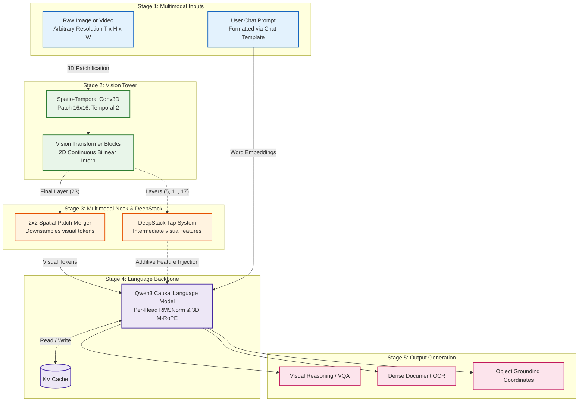

# Qwen3-VL — PyTorch Implementation

A modular, clean-room PyTorch implementation of **Qwen3-VL** (`Qwen/Qwen3-VL-4B-Instruct`). It couples a native dynamic-resolution spatio-temporal vision encoder with a **3D Multimodal RoPE (M-RoPE)** language backbone and includes **DeepStack multi-level feature injection**.

---

## 🧠 System Architecture

Qwen3-VL processes images and videos at arbitrary resolutions using 3D patch convolutions, downsamples spatial tokens via $2 \times 2$ patch mergers, injects intermediate visual representations into early decoder layers (DeepStack), and decomposes positional awareness across Temporal, Height, and Width axes:



- **Detailed Tensor Specification**: See [`assets/detailed_diagram.mmd`](./assets/detailed_diagram.mmd)
- **High-Level Flow Diagram**: See [`assets/high_overview_diagram.mmd`](./assets/high_overview_diagram.mmd)

---

## ⚡ Key Architectural Innovations

### 1. 3D Spatio-Temporal Patchification & Bilinear Grids (`modules/Vision.py`)

- **Conv3D Patching**: Handles both 2D static images and multi-frame 3D video volumes via `Conv3d(kernel_size=(2, 16, 16), stride=(2, 16, 16))`.
- **Learned 2D Bilinear Resampling**: Adapts fixed positional embedding tables ($48 \times 48 = 2304$) dynamically to arbitrary native resolutions without distortion.
- **Unpadded Chunked SDPA**: Flattens arbitrary aspect-ratio patches and executes attention using `cu_seqlens` chunk boundaries, eliminating padding waste.

### 2. DeepStack Multi-Level Feature Fusion

Rather than projecting only the final vision layer into the LLM, Qwen3-VL taps intermediate representations at layers `[5, 11, 17]`. These representations are projected through specialized post-shuffle patch mergers and **additively injected** directly into the early layers (`0, 1, 2`) of the language backbone. This preserves low-level visual details for fine-grained OCR and grounding.

### 3. 3D Multimodal RoPE (M-RoPE) (`modules/Text.py`)

Standard RoPE tracks a single 1D token offset. Qwen3-VL assigns **3D coordinates $[T, H, W]$** to every token:

- Text tokens: $T = H = W = \text{position}$.
- Image tokens: $T = \text{time}$, $H = \text{row index}$, $W = \text{column index}$.
- Head frequencies are partitioned into sections: $24$ for Temporal, $20$ for Height, and $20$ for Width ($24 + 20 + 20 = 64$ pairs = $128\text{d}$).

### 4. Per-Head RMSNorm

Before computing attention scores, Query and Key projections are normalized individually on their head dimension ($128$) using `RMSNorm(128, eps=1e-6)`. This prevents internal attention logit variance from drifting across long multi-turn contexts.

---

## ⚖️ Architectural Triad Comparison

| Feature               | PaliGemma 2              | Ministral-3 Multimodal          | Qwen3-VL                                     |
| :-------------------- | :----------------------- | :------------------------------ | :------------------------------------------- |
| **Vision Resolution** | Fixed $224 \times 224$   | Native Dynamic Aspect Ratio     | **Native Dynamic Spatio-Temporal**           |
| **Patch Method**      | 2D Conv ($14 \times 14$) | 2D Conv ($14 \times 14$)        | **3D Conv ($2 \times 16 \times 16$)**        |
| **Positional System** | 2D Bicubic Interp        | 2D Continuous Axial RoPE        | **2D Bilinear Table + 3D M-RoPE**            |
| **Feature Fusion**    | Single Linear Projector  | $2 \times 2$ Patch Merger + MLP | **$2 \times 2$ Merger + DeepStack (3 Taps)** |
| **Attention Norm**    | Sandwich RMSNorm         | Standard Pre-LN                 | **Per-Head RMSNorm (Q & K)**                 |
| **Segmentation**      | **Supported** (UViM VAE) | Not Supported                   | Not Supported (Bounding Boxes only)          |
| **Video Input**       | Single Image Only        | Single Image Only               | **Supported (Temporal Patches)**             |

---

## 🚀 Quickstart

### Launch the Unified Studio

Run all three models under the unified Gradio server with lazy loading:

```powershell
python Zoo/serve_multimodal.py
```
