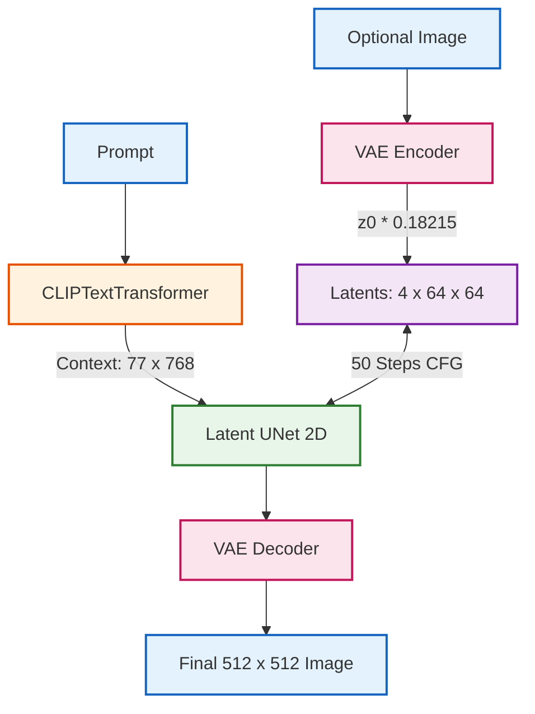

# Stable Diffusion v1.5 — PyTorch Implementation

A modular, dependency-light PyTorch clean-room implementation of **Stable Diffusion v1.5** (`runwayml/stable-diffusion-v1-5`). It integrates a Latent 2D UNet, AutoencoderKL (VAE), the DDPM ancestral scheduler, and directly reuses the shared **CLIP** text architecture from `Zoo.CLIP`.

---

## 🧠 System Architecture

Stable Diffusion performs diffusion synthesis in a lower-dimensional latent manifold ($64 \times 64$) compressed by an 8x factor from pixel space ($512 \times 512$):



- **Detailed Tensor Flow**: See [`assets/detailed_diagram.mmd`](./assets/detailed_diagram.mmd)
- **High-Level Flow Diagram**: See [`assets/high_overview_diagram.mmd`](./assets/high_overview_diagram.mmd)

---

## ⚡ Architectural Highlights

### 1. Unified Sub-Model Reuse

Instead of maintaining a separate copy of CLIP inside Stable Diffusion, the model instantiates `CLIPTextTransformer` directly from `Zoo.CLIP.modules.CLIPTextModel`, completely eliminating cross-model redundancy.

### 2. AutoencoderKL (`modules/VAE.py`)

- Compresses $(3, 512, 512)$ RGB images to $(4, 64, 64)$ continuous latent tensors.
- Implements the exact parameter keys of `first_stage_model.*` with internal downsampling/upsampling blocks and self-attention.
- Utilizes the standardized scaling factor: $\text{latent} = z \cdot 0.18215$.

### 3. Latent UNet (`modules/UNet.py`)

- Employs 12 input blocks, 1 middle bottleneck block, and 12 output blocks with cross-attention and skip connections.
- Native FlashAttention acceleration via `F.scaled_dot_product_attention`.
- Matches `model.diffusion_model.*` checkpoint topology natively.

### 4. DDPM Ancestral Scheduler (`modules/DDPM.py`)

- Precomputes $\beta_t$, $\alpha_t$, and $\bar{\alpha}_t$ using the official scaled linear schedule ($\beta \in [0.00085, 0.0120]$).
- Implements analytical forward noise injection and reverse ancestral steps via Tweedie's formula:
  $$x_0 = \frac{x_t - \sqrt{1 - \bar{\alpha}_t} \cdot \epsilon_\theta(x_t, t, c)}{\sqrt{\bar{\alpha}_t}}$$

---

## 🚀 Quickstart

### Launch Web Studio

```bash
python Zoo/image_generation.py
```

### Programmatic Python Usage

```python
from Zoo.StableDiffusion.StableDiffusion import StableDiffusionModel
from Zoo.StableDiffusion.pipeline.StableDiffusionPipeline import StableDiffusionPipeline

# 1. Load weights directly through the unified loader
model = StableDiffusionModel.from_pretrained_weights()

# 2. Initialize inference pipeline
pipeline = StableDiffusionPipeline(model=model)

# 3. Generate Image
image = pipeline(
    prompt="A futuristic neon cybernetic city in torrential rain, 8k resolution, cinematic masterpiece",
    cfg_scale=7.5,
    num_inference_steps=50,
    seed=42,
)
image.save("output.png")
```
